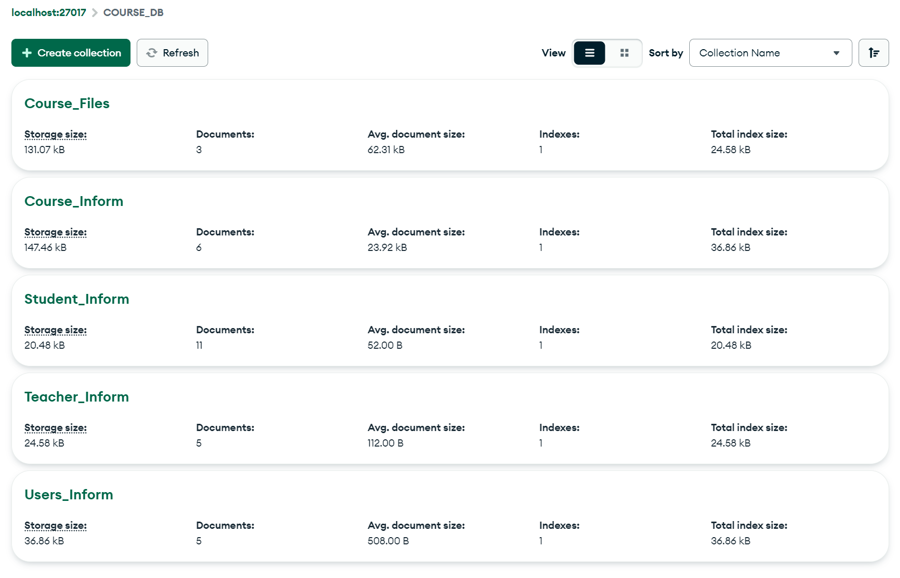
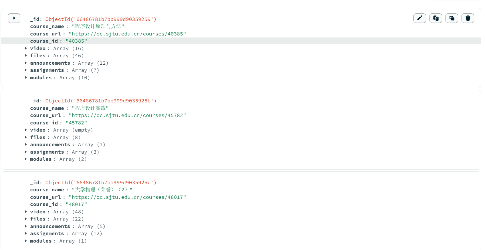
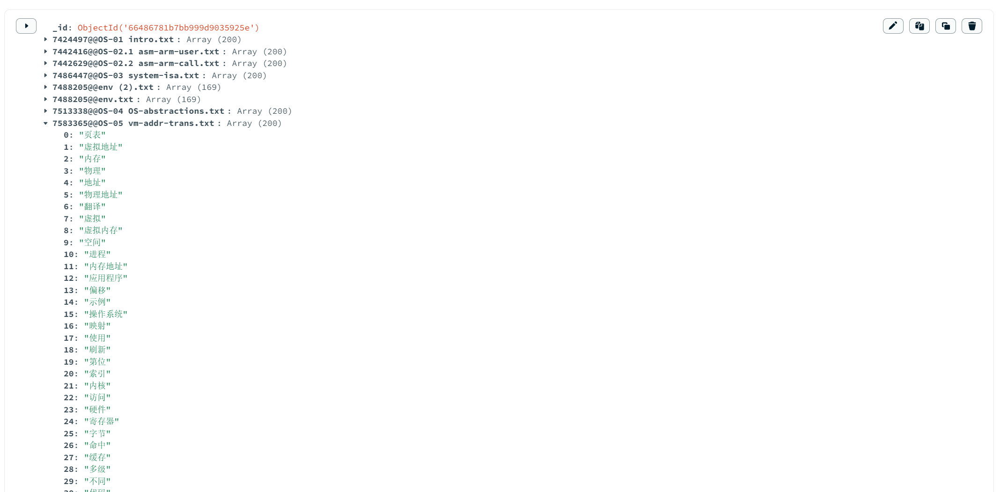
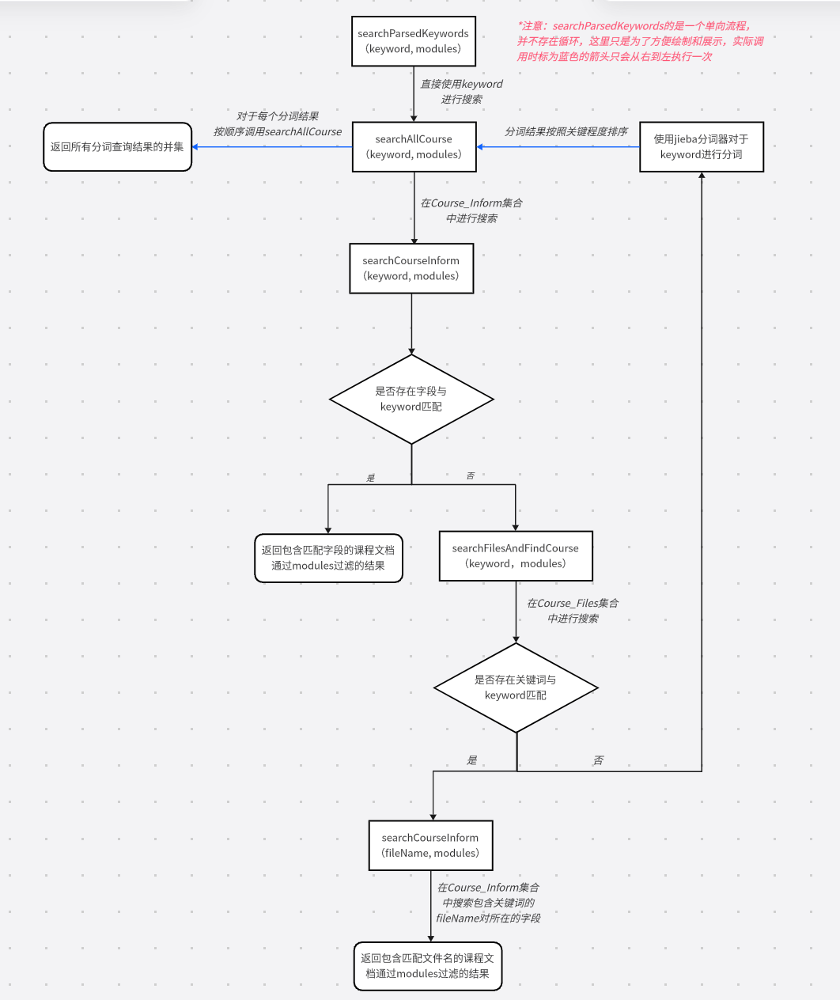

# Course_Stack 数据库管理系统项目文档


## 项目概述
本项目旨在使用MongoDB作为后端框架，并结合Node.js，搭建一个用于管理课程资料的数据库及对应的管理系统。系统主要功能包括课程资料的导入，课程资料的增删改查，课程资料检索，课程喜好标记，用户权限管理，以及数据库资料的备份与恢复。


## 开发环境
- **操作系统**: Windows 11
- **编程语言**: JavaScript (Node.js)
- **数据库**: MongoDB
- **框架与工具**:
  - Node.js v20.12.2
  
    ```json
    //package.json
      "dependencies": {
        "@node-rs/jieba": "^1.10.3",
        "axios": "^1.7.2",
        "bcrypt": "^5.1.1",
        "cors": "^2.8.5",
        "express": "^4.19.2",
        "jieba": "^1.0.0",
        "mongodb": "^6.7.0",
        "node-fetch": "^2.7.0"
      }
    ```
  - MongoDB shell v4.2.25
  - MongoDB Compass (用于数据库可视化与管理)
  


## 使用指南

mongdb_backend子仓库可以独立于Course_Stack主仓库进行使用

1. 将仓库克隆至本地

```

```


## 数据库数据组织方式

在Mongodb Compass可视化界面中，COURSE_DB数据库的整体组织形式如下：

<div style="text-align: center;">     
     
</div>


COURSE_DB数据库主要包括以下几个集合（Collections）：

### 1. 用户集合 (Users_Inform)

- 这里定义的用户主要是数据库的使用者，分为学生和教师两类。数据库管理员拥有最高权限，暂时没有登记在用户集合内。

- **字段**:
  - `_id`: 用户唯一标识 (Object Id)
  - `user_name`: 用户名 (String)
  - `password`: 密码 (String, 加密存储)
  - `role`: 角色 (String,  `teacher` 或 `student`)
  
    上述字段为用户元数据，不能为空
  
    
  
    下面的字段与用户操作相关，可以为空
  
  - `recentActions`：用户近期增删改操作记录（Array of Action Objects）
  
  - `likedCourses`：用户标记的喜爱课程（Array of Class Name Strings）
  
  

### 2. 教师身份验证集合 （Teacher_Inform）

- 教师只对教授课程集合内的课程有创建和增删改权限

- **字段**：
    - `_id`: 身份唯一标识（Object Id）
    - `Tname`: 教师姓名（String）
    - `id`: 教师工号（String）
    - `class`: 教授课程集合（Array of Class Name String）
    
    

### 3. 学生身份验证集合 （Student_Inform）

- 学生只有搜索课程资料和标记喜爱课程的权限

- **字段**：
    - `_id`: 身份唯一标识（Object Id）
    - `Sname`: 学生姓名（String）
    - `id`: 学生学号（String）
    
    

### 4. 课程信息集合 (Course_Inform)

- 本项目使用的课程数据来源于[canvas网站](https://oc.sjtu.edu.cn)，课程信息可以以json文件的形式从后端批量导入数据库

- **字段**:
  - `_id`: 课程唯一标识 (Object Id)
  - `course_name`: 课程名 (String)
  - `course_url`: 课程网址 (String)
  - `course_id`: 课程id (String)
  
  以上是课程的元数据，不能为空
  
  
  
  下面是不同模块的数据，可以初始化为空列表：
  
  - `video`: 课程视频（Array of Objects）
  
    - `video_id`：视频id（String）
    - `video_discrption`：视频描述（String）
    - `video_link1`，`video_link2`：视频链接（String）
  
  - `files`：课程文件（Array of Objects）
    - `file_id`：文件id（String）
    - `file_name`：文件名（String）
    - `file_url`：文件地址（String）
    - `file_folder`：文件目录（Array of String）
    - `download_path`：下载路径（String）
  
  - `announcements`：课程公告（Array of Objects）
    - `ann_id`：公告id（String）
    - `ann_title`：公告标题（String）
    - `ann_message`：公告信息（String）
  
  - `assignments`：课程作业（Array of Objects）
    - `assign_id`：作业id（String）
    - `assign_title`：作业标题（String）
    - `assign_ddl`：作业截止时间（String）
    - `assign_message`：作业信息（String）
    - `assign_file`：作业文件（Array of File Objects）
  
  - `modules`：课程单元（Array of Objects）
    - `module_id`：单元id（String）
    - `module_name`：单元名称（String）
    - `attachments`：单元附件（Array of Objects）
      
      - `attachment_id`：附件id（String）
      - `attachment_url`：附件地址（String）
      - `attachment_name`：附件名（String）
      
      

下面是Compass中Course_Inform集合的可视化界面：

<div style="text-align: center;">     
     
</div>

### 5. 课程文件集合 (Course_Files)

- 为了实现类似全文检索的效果，同时尽量降低检索的复杂度和尽量减少存储数据的量，将课程文件(files列表中的文件）进行ocr识别后转换为txt文本，使用jieba分词工具对于文本进行处理，筛选出其中权重最高的至多两百个词汇，作为关键词列表记录在本集合中。
- **字段**:
  - `_id`: 资料唯一标识 (Object Id)
  - `file_id@@file_name`: 文档关键词列表（Array of Keyword Strings）

下面是Compass中Course_Files集合的可视化界面：

<div style="text-align: center;">     
     
</div>


## 操作函数

以下操作函数均封装为Node js脚本的形式，位于main分支的main/database目录和main/course_db_api目录中。

### 数据库连接

- **连接到数据库**：`connectToDatabase()`
  - 给定uri和数据库名称，连接到本地mongodb数据库
- **关闭数据库连接**：`closeDatabaseConnection()`
  - 关闭之前开启的数据库连接
  
  

### 课程操作

课程操作分为可以在后端直接对数据库操作的接口和与前端对接供用户操作的接口，后者在用户操作中详细说明，此处仅说明管理员权限下的接口

- **导入课程数据**：`importCourseData(collection, filepath)`
  - 将对应filepath下的一个json文件作为一个完整的课程数据文档直接导入Course_Inform中
- **批量导入课程数据**：`importDataFromFile(filePath, collection)`
  - 将对应filepath下的所有json文件作为多个完整的课程数据文档直接导入Course_Inform中

- **新建课程**: `createCourse(collection, courseName, courseUrl, courseId)`
  - 使用课程的元数据在Course_Inform中建立一个新的课程文档，并将其余数据列表初始化为空
  - 在COURSE_DB中，为了方便后续逻辑的实现，规定课程名course_name字段不得重复
  
  例：新建课程名为英语的课程文档
  
  ```js
  await createCourse(course_info, '英语', 'https://oc.sjtu.edu.cn/courses/11111', '11111');
  ```
  
  

下面的操作涉及对于Course_Inform中数据的增删改，定义在main/course_db_api/modify_course_data中：

- **valid module**

  - 指定了一个课程文件中，可以进行修改的子模块和内层子模块

  ```javascript
  const validModules = {
    video: [],
    files: [],
    announcements: [],
    assignments: ['assign_file'],
    modules: ['attachments']
  };
  ```

- **插入课程数据**: `insertCourseData(collection, className, moduleName, data, idField)`

  - 将data中的数据插入Course_Inform中指定课程文档的指定位置
  - `className`：课程名，对应course_name字段（String）
  - `moduleName`：模块名，由于存在内层模块，因此是一个可以包含多个模块名的数组（Array of Strings）
  - `data`：需要插入的数据段，为了统一格式，对于某些非必须的字段使用null填充，同时规定了某些字段在插入时不能为空。在插入前，通过`validateData`函数将数据修改为合适的插入格式
  - `idField`：对于需要在内层子模块里插入的情况，可能需要通过子模块的idField来定位插入的具体位置。

  例1：在 大学英语 课程的 announcement 模块中新增一个 announcement

  ```js
  await insertCourseData(
      course_info, 
      '大学英语', 
      ['announcements'], 
      ann_id: 10001, ann_title: '新公告' }, //ann_message非必须字段，可以不指定 
      {} //没有嵌套模块，不用指定idField
  );
  ```

  例2：在 操作系统 课程的 modules 模块下，module_id为"context_module_156486" 的object对应的attachments 子模块中，新增一个attachment：

  ```js
  await insertCourseData(
  	course_info, 
  	'操作系统', 
  	['modules', 'attachments'], //存在内层子模块
  	{ attachment_id: 10001, attachment_url: 'https://example.com', attachment_name: 	'新的附件' }, 
  	{module_id: 'context_module_156486'} //指定第一层子模块下object的id
  );
  ```

  

- **更新课程数据**: `updateCourseData(collection, className, moduleName, idObject, updateFields)`

  - 将指定位置的数据按照updateFields中的要求进行更新，以object为粒度进行更新（一次可以更新一个object里的多个字段，但是不能更新多个object）
  - `className`：课程名，对应course_name字段（String）
  - `moduleName`：模块名，由于存在内层模块，因此是一个可以包含多个模块名的数组（Array of Strings）
  - `idObject`：通过id来定位需要更新的object在列表中的具体位置，由于存在内层模块，是一个可以包含多个id object的数组（Array of Id Objects）
  - `updateFields`：规定了对应的object里需要更新的字段

  例：更新 大学英语 课程的 announcement 列表中，对应 id 为 10001 的 object 中，ann_title 和 ann_message 中的字段

  ```js
  await updateCourseData(
  	course_info, 
  	'大学英语',
      ['announcements'],
      { ann_id : '10001'}, 
      { ann_title: '更新公告',  ann_message: '更新了公告' } //可以一次更新一个object中多个字段
  );
  ```

  

- **删除课程数据**: `deleteCourseData(collection, className, moduleName, idObject)`

  - 将指定位置的字段删除。为了保持数据库结构的完整性，删除操作以列表中的object为粒度，不能仅删除object的某一个字段。
  - `className`：课程名，对应course_name字段（String）
  - `moduleName`：模块名，由于存在内层模块，因此是一个可以包含多个模块名的数组（Array of Strings）
  - `idObject`：通过id来定位需要插删除的object在列表中的具体位置，由于存在内层模块，因此是一个可以包含多个id object的数组（Array of Id Objects）

  例1：删除 大学英语 课程的 announcement 列表中，id为'10001'的object

  ```js
  await deleteCourseData(
  	course_info, 
  	'大学英语', 
  	['announcements'], 
  	{ann_id : '10001'}
  );
  ```

  例2：删除 操作系统 课程的 modules列表中，id 为 'context_module_252143' 的 object 对应的 attachments 列表中，id 为 '1041918' 的 object

  ```js
  await deleteCourseData(
  	course_info, '操作系统', 
  	['modules', 'attachments'], 
  	{module_id : 'context_module_252143', attachment_id: '1041918'}
  );
  ```

  

- **批量删除课程数据**：`deleteManyCourseData(collection, className, moduleName)`

  - 将指定模块中所有的数据删除。该函数的实现基于`deleteCourseDatabyIndex`函数，原理是对于需要批量删除的模块，读取模块的长度，并按照索引序从高到低依次删除。
  - `className`：课程名，对应course_name字段（String）
  - `moduleName`：模块名，由于存在内层模块，因此是一个可以包含多个模块名的数组（Array of Strings）

  例：删除 大学物理（荣誉）（1）课程文档里的assignments列表中的所有objects

  ```js
  await deleteManyCourseData(
  	course_info, 
  	'大学物理（荣誉）（1）', 
  	['assignments']
  );
  ```


### 搜索函数

搜索函数为Course-Stack的核心功能，目标是对于给定的搜索词，返回和该搜索词可能相关的所有课程资料信息。该函数没有权限设置，定义在main/course_db_api/search_function中。

搜索函数的实现逻辑如下图所示：

<div style="text-align: center;">     
     
</div>

#### 使用方法

- 直接调用`searchParsedKeywords (db, keyword, modules)`函数
  - 根据上图中的逻辑执行分层搜索，最后返回Course_Inform中和keyword匹配，并通过modules过滤的课程数据信息。
  - `keyword`：搜索关键词，支持长关键词搜索（例如：加速度和角加速度，预防死锁的方式）（String）
  - `modules`：包含过滤条件的数组，'all' 表示返回所有模块中匹配的数据，如果不包含 'all'，则只返回对应模块里匹配的信息，可以同时指定多个模块过滤。

#### 搜索逻辑

- **step1：直接匹配课程信息**
  - 在Course_Inform中搜索是否有course_name与keyword匹配，记为result1
  - 在Course_Inform中搜索是否有course_name与keyword不匹配，但其他字段与keyword匹配的文档，记为result2
  - 合并result1和result2，记为results，如果不为空，则直接返回results过滤后的结果
  - 如果results为空，进入下一步
- **step2：在课程文档中进行关键词匹配**
  - 在Course_Files中搜索是否有文档的关键词列表中，有关键词与keyword匹配。如果有，则返回对应的文档id，在Course_Inform中进一步搜索id匹配的文档数据，记为result3
  - 如果不为空，直接返回result3过滤后的结果
  - 如果result3为空，进入下一步
- **step3：分词后重复上述匹配过程**
  - 如果step1和step2均没有有效结果，大概率是因为输入的关键词过于复杂。使用jieba分词工具对于输入的keyword进行分词并按照权重从高到低排序，按顺序对于每一个分词执行step1-2的过程，将结果合并并返回。
  - 如果进行分词后仍然得不到有效结果，则返回空列表

#### 特点与合理性

- **分层搜索**：降低了在输入关键词较为简单的情况下的搜索复杂度，例如搜索”物理“，会直接返回课程名称包含物理的课程。显然如果在这种情况下执行step2-3的搜索，大概率会返回step1中搜索结果的子集，因此没有必要。
- **伪全文搜索**：在数据库中存储文档中权值最高的关键词，并在内层搜索中对于关键词进行匹配，而不是进行真正的全文搜索，有效降低了内层搜索的复杂度，并且最终也能达到较为理想的效果
- **支持分词**：分词并基于权重排序可以有效过滤掉查询条件中的非关键信息，并对于长文本查询提供支持
- **接口简单**：用户只需要输入关键词和过滤条件，就能得到想要的结果，而不需要关系其中复杂逻辑的实现


### 用户操作

与用户相关的操作在github仓库的另一条分支

- **用户注册**: `registerUser(db, username, password, role, identifier)`
  - 用户在注册时需要创建用户名（不允许重名），设置密码（加密后在数据库中存储），指定角色并通过id在Student/Teacher集合中验证是否符合角色权限

- **用户登录**：`loginUser(db, username, password)`
  - 用户在登录时只需要输入用户名和密码

- **用户操作**：除了搜索函数不需要用户权限，其余操作均在基本函数的基础上外包了一层函数，接受用户名作为额外输入，并根据用户名检查用户权限。只有当用户角色为teacher，并且在Teacher_Inform中有记录对应的className时才能执行下面的操作。
  - 插入：`
  - 删除：
  - 修改：
  - 批量删除：
  - 创建：


## 前端接口

### 用户接口

- **注册**: `POST /api/users/register`
  - **请求参数**: `username`, `password`, `role`
  - **响应**: 成功消息或错误消息

- **登录**: `POST /api/users/login`
  - **请求参数**: `username`, `password`
  - **响应**: 成功消息（包括token）或错误消息

- **获取用户信息**: `GET /api/users/:id`
  - **请求参数**: 用户ID
  - **响应**: 用户信息

### 课程接口

- **创建课程**: `POST /api/courses`
  - **请求参数**: `title`, `description`
  - **响应**: 成功消息或错误消息

- **获取所有课程**: `GET /api/courses`
  - **响应**: 课程列表

- **更新课程**: `PUT /api/courses/:id`
  - **请求参数**: `title`, `description`
  - **响应**: 成功消息或错误消息

- **删除课程**: `DELETE /api/courses/:id`
  - **请求参数**: 课程ID
  - **响应**: 成功消息或错误消息

### 资料接口

- **添加资料**: `POST /api/materials`

  - **请求参数**: `name`, `type`, `url`
  - **响应**: 成功消息或错误消息

- **获取所有资料**: `GET /api/materials`

  - **响应**: 资料列表

- **更新资料**: `PUT /api/materials/:id`

  - **请求参数**: `name`, `type`, `url`
  - **响应**: 成功消息或错误消息

- **删除资料**: `DELETE /api/materials/:id`

  - **请求参数**: 资料ID
  - **响应**: 成功消息或错误消息

  

## 后续优化

COURSE_DB作为一个初具雏形的简单课程资料管理数据库系统，还存在很多的优化空间。我们针对测试中的问题，提出了以下几种优化方向：

1. **增加回滚操作**：目前仅对于用户的操作在Users_Inform中进行了记录，而没有增加回滚功能。考虑到不同用户对于数据库的操作存在并行关系，实现每个用户独立撤销自己的操作比较困难，我们暂且只考虑设计一个整体的供数据库管理员操作的回滚功能。

   具体实现思路：新增一个Action_Record集合，按照时间顺序记录所有针对数据库数据进行增删改的操作。管理员可以通过查看该集合，将数据库恢复到某一个指定时间点的状态。

2. **增加历史查询记录**：在Users_Inform中每个用户的文档里新增一个searchHistory列表，用于记录用户近期的查询关键词和结果。在用户进行新的查询时，优先在查询列表里查看有无匹配的关键词，如果有则直接返回查询结果。在数据库规模较大的时候可以显著提高查询效率。

3. **规定字段权限**：目前对于Course_Inform中字段的使用并不完全规范，对于不同字段设置更加细粒度的read和write权限更有利于数据库的管理和使用。

4. **增强安全性**：当前数据库基本没有在安全性上的加强措施。为了保障数据安全，可以采取启用MongoDB身份验证，使用TLS/SSL加密MongoDB通信，在Node js应用层进行输入验证，添加SQL注入防护等措施。
